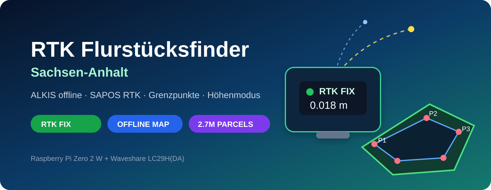
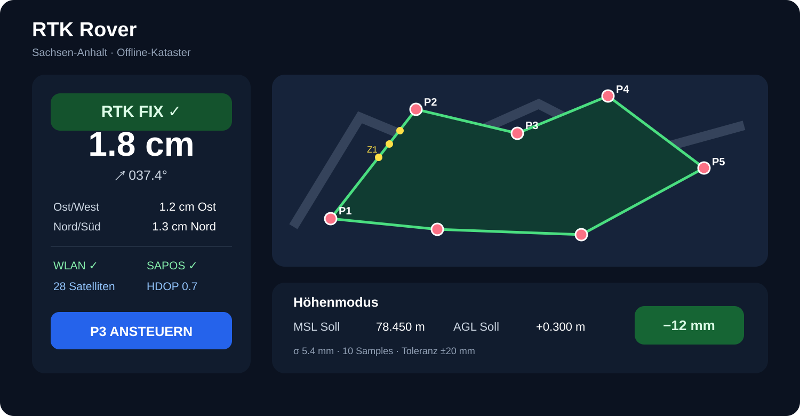
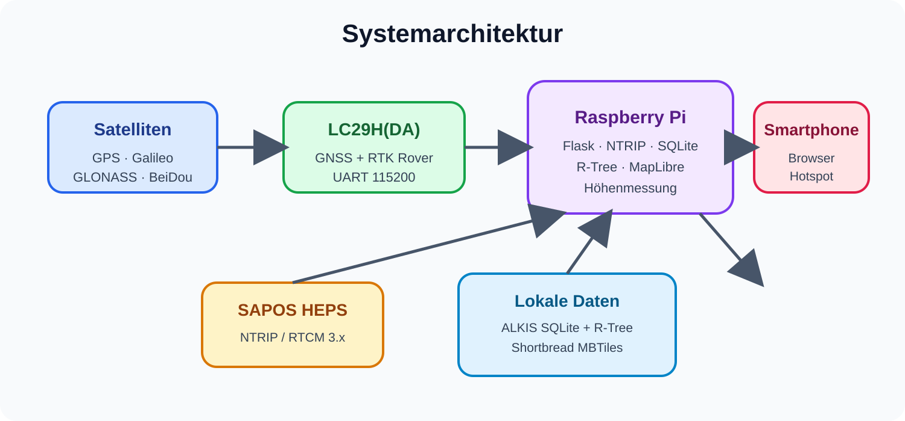

<div align="center">



# RTK Flurstücksfinder Sachsen-Anhalt

**Ein kompakter Open-Source-RTK-Rover für Raspberry Pi + LC29H mit landesweiter Offline-ALKIS-Suche, Offlinekarte, Grenzpunktnavigation und Höhenmodus.**

[](https://www.python.org/)
[](https://www.raspberrypi.com/products/raspberry-pi-zero-2-w/)
[](#rtk-und-sapos)
[](#offline-karte)
[](LICENSE)

</div>

> [!IMPORTANT]
> Das Projekt dient zum Auffinden und Visualisieren digitaler ALKIS-Flurstücksgeometrien. Es ersetzt **keine amtliche Grenzfeststellung, Abmarkung oder Vermessung**. Für rechtssichere Grenzfragen ist die zuständige Vermessungsstelle maßgeblich.

## Was das Projekt kann

- 📍 **RTK-Navigation** zu Flurstückseckpunkten mit Richtung, Distanz und Ost-/Nord-Abweichung
- 🗺️ **komplett offline nutzbare Karte** für Sachsen-Anhalt auf Basis von Geofabrik/OpenStreetMap
- 🧭 **automatische Flurstückserkennung** an der aktuellen RTK-Position
- 🔎 Auswahl über **Landkreis → Gemarkung → Flur → Flurstück**
- 🧱 Darstellung der originalen ALKIS-Eckpunkte als **P1, P2, P3 …**
- ➕ optionale Hilfspunkte **Z1, Z2, Z3 …** im Abstand von 2 m / 5 m / 10 m
- 👆 Flurstück und Zielpunkte direkt **auf der Karte antippen**
- 🌐 **SAPOS HEPS/NTRIP** für RTK-Korrekturdaten über Smartphone-Hotspot
- 📶 Live-Status für WLAN, Internet, SAPOS, RTCM, Satelliten, HDOP und RTK FIX/FLOAT
- 📏 **Höhenmodus** mit MSL und lokalem AGL-Bezug, Sollhöhe, Toleranzampel, Mittelung und Streuung
- 💾 landesweite ALKIS-Datenbank lokal auf der SD-Karte; Internet wird draußen nur noch für SAPOS benötigt
- 📱 Smartphone als Display — kein Display am Raspberry Pi erforderlich



## Hardware

Die Referenzkonfiguration ist bewusst günstig gehalten:

| Komponente | Empfehlung |
|---|---|
| Rechner | Raspberry Pi Zero 2 W |
| RTK-GNSS | Waveshare LC29H(DA) GPS/RTK HAT |
| Antenne | Dualband-GNSS-Antenne, möglichst auf Stab/Groundplane |
| Internet | Smartphone-Hotspot |
| Strom | USB-Powerbank |
| Mechanik | Vermessungs-/GNSS-Stab mit Dosenlibelle |

Der LC29H(DA) wird als **Rover** betrieben. Beim Waveshare-HAT gehören beide UART-Jumper für den Raspberry-Pi-GPIO-Betrieb auf **Position B**.

## Architektur



Der Raspberry Pi verbindet drei Welten:

1. **LC29H** liefert GNSS/NMEA und empfängt RTCM über UART.
2. **SAPOS HEPS** liefert Korrekturdaten über NTRIP und den Smartphone-Hotspot.
3. **Lokale Daten** liefern ALKIS-Flurstücke und die Offline-Basiskarte ohne Cloud-Abhängigkeit.

## Schnellstart

### 1. Raspberry Pi vorbereiten

Empfohlen: **Raspberry Pi OS Lite 64-bit**. SSH und WLAN bereits im Raspberry Pi Imager aktivieren.

UART aktivieren:

```bash
sudo raspi-config
```

Unter `Interface Options → Serial Port`:

- Login shell over serial: **No**
- Serial port hardware enabled: **Yes**

Danach neu starten.

### 2. Repository installieren

```bash
git clone https://github.com/DEIN-USER/rtk-flurstuecksfinder-sachsen-anhalt.git
cd rtk-flurstuecksfinder-sachsen-anhalt
chmod +x install.sh
./install.sh
sudo reboot
```

Danach im Smartphone-Browser:

```text
http://rtk.local:5000
```

> Wenn `rtk.local` im Netz nicht aufgelöst wird, die IP des Pi mit `hostname -I` anzeigen und `http://<IP>:5000` öffnen.

## Landesweite ALKIS-Datenbank

Die große Datenbank liegt **nicht im Repository**. Sie wird aus dem amtlichen Open-Data-Download des LVermGeo Sachsen-Anhalt erzeugt.

### Windows

PowerShell im Repository öffnen:

```powershell
Set-ExecutionPolicy -Scope Process Bypass
.\scripts\STATEWIDE_WINDOWS.ps1
```

Das Skript:

1. lädt `GBIS_Flurstuecke.zip` vom LVermGeo,
2. wandelt die GML/XML-Daten in eine kompakte SQLite-Datenbank um,
3. erzeugt einen R-Tree-Raumindex,
4. kopiert die fertige Datenbank auf `rtk.local`,
5. aktiviert sie auf dem Pi.

Die Datenbank enthält **keine Eigentümerdaten**; das Projekt verarbeitet nur die bereitgestellten Open-Data-Flurstücksinformationen.

### Nur Datenbank bauen

```bash
python tools/build_alkis_db.py GBIS_Flurstuecke.zip alkis_st.sqlite
python tools/db_info.py alkis_st.sqlite
```

Die Geometrien bleiben mit Millimeterauflösung in **ETRS89 / UTM Zone 32N (EPSG:25832)** gespeichert und werden komprimiert abgelegt.

## Offline-Karte

Auf dem Pi:

```bash
chmod +x scripts/download_offline_map.sh
./scripts/download_offline_map.sh
```

Die Karte wird als Geofabrik-Shortbread-MBTiles gespeichert. Die Weboberfläche stellt die Vektorkacheln lokal bereit; unterwegs ist dafür keine Internetverbindung nötig.

## RTK und SAPOS

Die Standardkonfiguration liegt in `rtk.env.example`:

```ini
NTRIP_HOST=4G.sapos-lsa-ntrip.de
NTRIP_PORT=2101
NTRIP_MOUNTPOINT=VRS_3_4G_ST
NTRIP_USER=user
NTRIP_PASSWORD=user
```

Vor dem Einsatz bitte die aktuellen Angaben des LVermGeo prüfen:

- SAPOS HEPS / NTRIP: https://www.lvermgeo.sachsen-anhalt.de/de/gdp-heps-korrekturdatenabgabe.html
- SAPOS FAQ: https://www.lvermgeo.sachsen-anhalt.de/de/sapos_faq.html

Für die Zentimetersuche sollte die Anzeige **RTK FIX** zeigen. `RTK FLOAT`, normales GNSS oder DGNSS sind dafür nicht gleichwertig.

SAPOS empfiehlt bei HEPS Kontroll-/Doppelmessungen. Das Projekt zeigt deshalb den Fixstatus deutlich an, ersetzt aber keine vermessungstechnische Qualitätskontrolle.

## Flurstücke und Zielpunkte

Ein geladenes Flurstück liefert automatisch:

- **P1, P2, …**: Stütz-/Eckpunkte der digitalen ALKIS-Polygongeometrie
- **Z1, Z2, …**: optional erzeugte Hilfspunkte auf geraden Segmenten

Die P-/Z-Bezeichnungen sind **Arbeitsbezeichnungen des Projekts**, keine amtlichen Grenzpunktnummern.

Hilfspunkte können mit 2 m, 5 m oder 10 m Abstand erzeugt werden. Auf der Karte lassen sich Zielpunkte antippen und direkt als Navigationsziel übernehmen.

## Höhenmodus

Der Höhenmodus speichert mehrere RTK-FIX-Messungen über einen einstellbaren Zeitraum und zeigt unter anderem:

- Mittelwert
- Anzahl der Samples
- Sigma / Streuung
- Spannweite
- Stabhöhenkorrektur
- Sollhöhe
- Abweichung in mm
- Toleranzampel

### MSL

**MSL** ist die vom GNSS/NMEA-GGA gemeldete Höhe über dem mittleren Meeresspiegel/Geoid. Eine absolute Sollhöhe kann z. B. als `78.450 m` vorgegeben werden.

### AGL / lokaler Bezug

Der AGL-Modus des Projekts ist ein **lokaler relativer Höhenbezug** zu einem vom Nutzer gesetzten Referenzpunkt. Wird der Referenzpunkt auf Gelände gesetzt, entspricht dies praktisch einer Höhe über diesem Gelände-Bezug.

Beispiel:

```text
Referenz: OK Gelände
Soll AGL: +0.300 m
Toleranz: ±20 mm
```

> [!WARNING]
> RTK-GNSS ist in der Höhe typischerweise schwächer als in der Lage. Für millimetergenaue Endkontrollen an Bodenplatten, Schalungen oder Fundamenten sollte zusätzlich ein Nivelliergerät bzw. Rotationslaser verwendet werden.

## Datenquellen

### ALKIS / LVermGeo Sachsen-Anhalt

Amtlicher Open-Data-Download:

```text
https://www.geodatenportal.sachsen-anhalt.de/gfds_webshare/download/LVermGeo/Geodatenportal/externedaten/GBIS_Flurstuecke.zip
```

Metadaten / WFS: https://www.geodatenportal.sachsen-anhalt.de/

Die Daten stehen unter den jeweils angegebenen Nutzungsbedingungen, insbesondere der **Datenlizenz Deutschland – Namensnennung 2.0**. Dieses Repository enthält die Daten selbst nicht.

### OpenStreetMap / Geofabrik

Offline-Basiskarte:

```text
https://download.geofabrik.de/europe/germany/sachsen-anhalt-shortbread-1.0.mbtiles
```

OpenStreetMap-Daten stehen unter ODbL. Attribution und Nutzungsbedingungen sind zu beachten.

## Verzeichnisstruktur

```text
.
├── app.py                         # Flask-Webapp, GNSS, NTRIP, Karte, Höhenmodus
├── parcel_db.py                   # lokale ALKIS-Abfragen + R-Tree
├── install.sh                     # Installation auf Raspberry Pi OS
├── rtk-rover.service              # systemd Autostart
├── rtk.env.example                # NTRIP-Konfiguration
├── requirements.txt
├── data/                          # lokale DB/MBTiles (gitignored)
├── static/                        # lokal gecachte MapLibre-Dateien
├── scripts/
│   ├── STATEWIDE_WINDOWS.ps1      # landesweite ALKIS-DB bauen + übertragen
│   ├── STATEWIDE_WINDOWS.cmd
│   └── download_offline_map.sh
├── tools/
│   ├── build_alkis_db.py
│   ├── download_statewide_alkis.py
│   └── db_info.py
└── docs/
    ├── hero.svg
    ├── architecture.svg
    └── ui-preview.svg
```

## Diagnose

```bash
systemctl status rtk-rover
journalctl -u rtk-rover -f
ls -l /dev/serial0
```

Webserver lokal testen:

```bash
curl http://127.0.0.1:5000/api/status
```

## Datenschutz

Die Anwendung benötigt keinen Cloud-Account und sendet die lokalen ALKIS-Daten nicht an einen externen Dienst. Für RTK wird lediglich die aktuelle NMEA-GGA-Näherungsposition an den konfigurierten NTRIP-Caster übermittelt, wie für VRS-Korrekturdaten erforderlich.

## Mitmachen

Fehlerberichte und Pull Requests sind willkommen. Siehe [CONTRIBUTING.md](CONTRIBUTING.md).

## Lizenz

Der **Programmcode** dieses Projekts steht unter der [MIT License](LICENSE).

Für ALKIS-, SAPOS-, OpenStreetMap- und Geofabrik-Daten gelten jeweils deren eigene Nutzungsbedingungen. Siehe [NOTICE.md](NOTICE.md).
